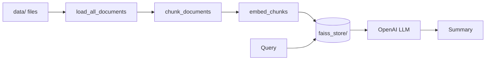

# RAG with LangChain

A small retrieval-augmented generation (RAG) pipeline over your own documents:

1. **Load** files from `data/` (PDF, TXT, CSV, Excel, Word, JSON) as LangChain documents
2. **Chunk** them with `RecursiveCharacterTextSplitter`
3. **Embed** chunks with the `all-MiniLM-L6-v2` SentenceTransformer model
4. **Index** the vectors in FAISS, persisted to `faiss_store/`
5. **Retrieve** the closest chunks for a query and **summarize** them with an OpenAI chat model



## Project structure

```
.
├── app.py               # Entry point: ask a question from the command line
├── src/
│   ├── data_loader.py   # load_all_documents(): file -> LangChain documents
│   ├── embedding.py     # EmbeddingPipeline: chunking + embeddings
│   ├── vectorstore.py   # FaissVectorStore: build, save, load, query
│   └── search.py        # RAGSearch: retrieval + OpenAI summary
├── data/                # Source documents (sample PDFs and text files)
├── notebook/            # Step-by-step exploration notebooks
└── notes/               # Notes on RAG concepts
```

## Getting started (first run)

Requires Python 3.9+ and an [OpenAI API key](https://platform.openai.com/api-keys).

**1. Clone the repo**

```bash
git clone <repo-url>
cd RAG-with-langchain
```

**2. Install dependencies**

With [uv](https://docs.astral.sh/uv/) (recommended):

```bash
uv sync
source .venv/bin/activate   # Windows: .venv\Scripts\activate
```

Or with pip:

```bash
python3 -m venv .venv
source .venv/bin/activate   # Windows: .venv\Scripts\activate
pip install -r requirements.txt
```

**3. Add your API key**

```bash
cp .env.example .env
```

Open `.env` and set `OPENAI_API_KEY` (and optionally `OPENAI_MODEL`).

**4. Add documents (optional)**

`data/` already has sample PDFs and text files. Drop in your own files (PDF, TXT, CSV, `.xlsx`, `.docx`, `.json`). Subfolders are searched too.

**5. Run it**

```bash
python app.py "What happens in As You Like It?"
```

The first run loads every file in `data/`, splits it into chunks, embeds the chunks and saves a FAISS index to `faiss_store/`. This takes a minute or two, and the embedding model is downloaded the first time. Later runs reuse the saved index and start quickly.

> **Changed your documents?** Delete `faiss_store/` and run again to rebuild the index. `faiss_store/` is generated locally and is not committed to the repo.

## Usage

Each module can also be run on its own to test that stage:

```bash
python -m src.data_loader    # load documents
python -m src.embedding      # chunk + embed
python -m src.vectorstore    # build the index and run a sample query
python -m src.search         # full retrieve + summarize
```

Use it from Python:

```python
from src.search import RAGSearch

rag = RAGSearch()  # options: persist_dir, data_dir, embedding_model, llm_model
print(rag.search_and_summarize("What happens in As You Like It?", top_k=3))
```

## Configuration

| Setting | Where | Default |
| --- | --- | --- |
| `OPENAI_API_KEY` | `.env` | required |
| `OPENAI_MODEL` | `.env` | `gpt-6-luna` |
| Embedding model | `RAGSearch(embedding_model=...)` | `all-MiniLM-L6-v2` |
| Chunk size / overlap | `FaissVectorStore(chunk_size=..., chunk_overlap=...)` | `1000` / `200` |
| Index location | `RAGSearch(persist_dir=...)` | `faiss_store/` |

## Notes

- Supported file types: PDF (`pypdf`), TXT, CSV, Excel `.xlsx` (`unstructured`), Word `.docx` (`docx2txt`) and JSON (`jq`). Files that fail to load are logged and skipped.
- The notebooks build a separate Chroma database in `data/vector_store/`. It is generated locally and is not committed.
- Retrieval uses FAISS `IndexFlatL2`, so a **smaller distance means a closer match**.
