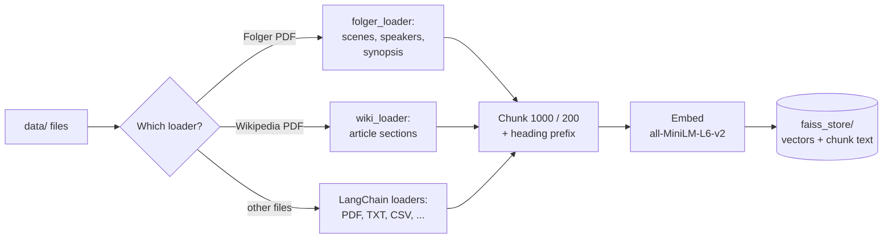
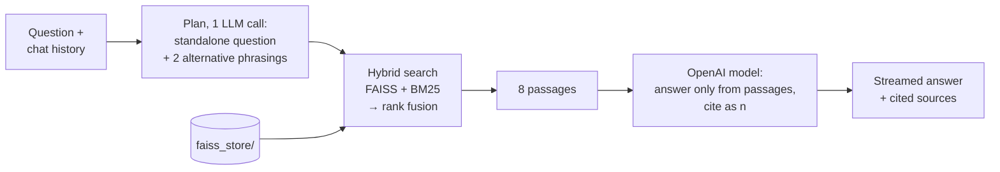

# Shakespeare RAG

Ask questions about Shakespeare's plays and poems and get answers drawn from the texts. The dataset is 38 plays and 4 poem collections from the [Folger Shakespeare Library](https://www.folger.edu/explore/shakespeares-works/) editions, plus a Wikipedia biography of Shakespeare for questions about his life and career. It comes with a Streamlit chat UI.

**Live demo:** [shakespeare-rag-taniket.streamlit.app](https://shakespeare-rag-taniket.streamlit.app/)


## Contents

1. [Getting started](#getting-started)
2. [How it works](#how-it-works)
3. [How it was built: development phases](#how-it-was-built-development-phases)
4. [Key design decisions and trade-offs](#key-design-decisions-and-trade-offs)
5. [Evaluation](#evaluation)
6. [Project structure](#project-structure)
7. [Usage](#usage)
8. [Configuration](#configuration)
9. [Notes](#notes)

**Highlights**

- **Layout-aware ingestion** of the Folger PDFs: one clean document per scene, sonnet or synopsis, with every speech attributed to its speaker
- **Hybrid retrieval**: FAISS vector search + BM25 keyword search, merged with Reciprocal Rank Fusion, plus LLM query expansion
- **Grounded, cited answers**: the model answers only from the retrieved passages, cites them as [1], [2], and says when they don't contain the answer
- **Follow-up questions** ("who is her cousin?") resolved from the conversation
- **Measured**: retrieval accuracy went from 56–64% (vector search) to 100%, and answers from 15/17 to 17/17 faithful, on the evals in `evals/`

## Getting started

Requires Python 3.12+ and an [OpenAI API key](https://platform.openai.com/api-keys).

**1. Clone the repo**

```bash
git clone https://github.com/taniket15/shakespeare-rag.git
cd shakespeare-rag
```

**2. Install dependencies**

With [uv](https://docs.astral.sh/uv/) (recommended):

```bash
uv sync
source .venv/bin/activate   # Windows: .venv\Scripts\activate
```

Or with pip:

```bash
python3 -m venv .venv
source .venv/bin/activate   # Windows: .venv\Scripts\activate
pip install -r requirements.txt
```

**3. Add your API key**

```bash
cp .env.example .env
```

Open `.env` and set `OPENAI_API_KEY`. The other settings (model, `IS_LOCAL` and chat usage limits) are optional and commented out with their defaults. Set `IS_LOCAL=true` on your machine to turn off the usage limits.

**4. Add documents (optional)**

`data/pdf/Shakespeare/` already has the Folger editions and the biography. To search other material, drop in your own files (PDF, TXT, CSV, `.xlsx`, `.docx`, `.json`). Subfolders are searched too.

**5. Build the vector store (only if you changed `data/`)**

```bash
python -m src.vectorstore
```

The repo already includes a prebuilt index in `faiss_store/`, so you can skip this step. Rebuilding loads every file in `data/`, chunks and embeds it, saves the index to `faiss_store/` and runs a sample query. It takes a couple of minutes (the embedding model is downloaded the first time) and doesn't need an OpenAI key. Commit `faiss_store/` again after rebuilding so the deployed app gets the new index.

**6. Ask from the command line**

```bash
python app.py "What happens in As You Like It?"
```

**7. Chat in the browser**

```bash
streamlit run chat.py
```

This opens the chat at http://localhost:8501. The sidebar has example questions and lists the works in the dataset.

## How it works

The system has two pipelines: **ingestion** builds the search index once, and **question answering** runs for every question.

### 1. Ingestion (build time)

Run with `python -m src.vectorstore`. It needs no API key.



1. **Load.** `src/data_loader.py` picks a loader per file:
   - **Folger PDFs** (`src/folger_loader.py`) are parsed from the page layout (font sizes and positions) with PyMuPDF, not as plain text. The loader drops the Folger ad, table of contents, director's note and textual introduction, plus the `FTLN` line markers, line numbers and running page headers. It keeps the **Synopsis** and **Characters in the Play** pages, attaches every speech to its speaker (`LADY MACBETH: …`, `ROBIN [aside]: …`), marks stage directions with `[brackets]`, and splits each work into **one document per scene, prologue, sonnet or front-matter section**, tagged with `title`, `section` and `page`.
   - **Wikipedia PDF exports** (`src/wiki_loader.py`, recognized by their metadata) become one document per article section, without references, contributor lists, image captions or `[n]` citation markers.
   - **Anything else** (PDF, TXT, CSV, Excel, Word, JSON) uses the standard LangChain loaders, so you can add your own documents.
2. **Chunk.** `RecursiveCharacterTextSplitter` cuts documents into 1,000-character chunks with 200 characters of overlap. Each chunk then gets its location as a first line (e.g. `Macbeth, Act 1, Scene 7` or `Shakespeare's Sonnets, Sonnet 18`), so both the embedding and the LLM know where it comes from.
3. **Embed.** Each chunk becomes a 384-dimension vector with the `all-MiniLM-L6-v2` sentence-transformers model, running locally.
4. **Store.** Vectors go into a FAISS `IndexFlatL2` index and the chunk text and metadata into `metadata.pkl`, both in `faiss_store/`. The index is committed, so the deployed app loads it instead of re-embedding the corpus at startup.

Current dataset: 42 Folger PDFs + 1 biography → **1,028 documents → 7,470 chunks**.

### 2. Question answering (per question)



1. **Plan** (`RAGSearch.plan` in `src/search.py`). One structured LLM call rewrites a follow-up into a standalone question using the last 3 exchanges ("who is her cousin?" → "Who is Rosalind's cousin in *As You Like It*?"). It also writes **2 alternative phrasings** in the vocabulary a source would use (query expansion), e.g. "Did someone else write his plays?" → "Shakespeare authorship question".
2. **Retrieve** (`HybridRetriever` in `src/retriever.py`):
   - **Work detection:** if the question names a work (full title, short form like "Lear" or "Tempest", "Henry IV" for both parts, or "Sonnet 18"), only that work is searched.
   - **Vector search** (FAISS) finds passages with the same *meaning*; **BM25 keyword search** finds the same *words*: quotes, names, numbers.
   - **Reciprocal Rank Fusion** merges the two rankings by position, so their different score scales don't matter.
   - **Safeguards for exact wording:** passages containing a quoted phrase from the question go first, and the top 2 keyword matches always keep a slot.
   - **Query expansion:** the best results for the alternative phrasings fill 2 of the 8 slots.
   - **Overview questions:** when a play is named, its Synopsis is always included.
3. **Answer** (`RAGSearch.stream`). The OpenAI model gets the numbered passages and a prompt that tells it to use only them, cite them as [1], [2], combine specific details, and say plainly when the passages don't contain the answer. The answer streams into the UI.
4. **Show** (`chat.py`). The chat shows the answer, a "Searched for" line when a follow-up was rewritten, and the **cited sources** with work, act and scene, page, and an excerpt. Usage limits protect the API budget of the public demo.

## How it was built: development phases

The project started from a tutorial-style RAG pipeline and was improved in phases. Each phase began by measuring a problem and ended by measuring the fix.

### Phase 0: Starting point

A generic LangChain pipeline: `PyPDFLoader` for every PDF, 1,000/200 chunking, MiniLM embeddings, FAISS, the **top 3** chunks by vector similarity, and a prompt that said *"Summarize the following context for the query"*. The first version indexed 6 plays (about 1,600 chunks). It grew to all 42 Folger works, together with 4 unrelated sample files left over from the tutorial (a sample PDF, an AI research paper and two text files), for **9,781 chunks**.

Getting it deployed on Streamlit Community Cloud took a few fixes: shipping a prebuilt index (building it at startup hung the app), disabling Streamlit's file watcher (it imported hundreds of `transformers` modules, slowing startup and flooding the logs with errors), and migrating to LangChain 1.x (`langchain.text_splitter` → `langchain_text_splitters`) after the move to Python 3.12.

### Phase 1: Clean, structured ingestion

**Problem:** the plain-text PDF extraction was noisy and lost structure:
- **17% of all indexed text** was Folger line markers like `FTLN 1182` (130,875 of them).
- **248 chunks** were Folger front and back matter (ads, editorial notes) rather than Shakespeare.
- **Speaker names were separated from their lines**: PyPDF put all of a page's names in one block, so the index didn't know who said what.
- "What is Sonnet 18 about?" retrieved three plays and no sonnets.

**Change:** a layout-aware Folger loader (`src/folger_loader.py`, described above), heading lines on every chunk, and removal of the unrelated sample files and tutorial notebooks. Getting speakers right needed one more fix: in verse the name sits above the first line, but in prose it's on the line 2pt lower, which shifted prose speeches to the wrong speaker until speaker positions were handled for both layouts.

**Result:** 9,781 → **7,424 chunks**, **0** line markers and **0** boilerplate chunks left, **12/12** famous lines attributed to the right speaker, and right work as the top result **11/12 → 12/12** on a 12-question check. Plot questions now retrieve each play's Synopsis.

### Phase 2: Grounded answers with citations

**Problem:** the "summarize" prompt let the model fill gaps from its own memory. Asked who says "The quality of mercy is not strained", it answered correctly *although retrieval had returned Measure for Measure passages*. That kind of answer can't be checked, and it hides retrieval failures.

**Change:** a grounded prompt (use only the passages, cite them as [n], say so when they don't contain the answer), a sources panel under each answer, and 5 passages instead of 3.

**Result:** the mercy question now honestly reported that the passages didn't contain the line, which exposed the retrieval gap fixed in phase 3. Off-topic questions ("What is the capital of France?") are declined.

### Phase 3: Hybrid retrieval

**Problem:** vector search matches meaning, not wording, so it missed quotes ("Out, damned spot"), sonnet numbers and exact phrases.

**Change:** BM25 keyword search alongside FAISS, merged with Reciprocal Rank Fusion, plus work detection. Testing found that rank fusion could still bury a passage that was first for keywords but weak for vectors ("Double, double toil and trouble"), so two safeguards were added: quoted phrases go first, and the top 2 keyword matches always keep a slot.

**Result** (new 25-question retrieval eval): vector-only **56%** → hybrid **100%**. Unquoted versions of famous lines and the multi-part Henry plays were also checked.

### Phase 4: Follow-up questions

**Problem:** every question was answered on its own, so "Who is her cousin?" failed.

**Change:** follow-ups are rewritten into standalone questions from the recent conversation, and the UI shows what was searched. This phase also caught a regression from phase 3: naming a play limited the search to its scenes, so "What happens in As You Like It?" lost the Synopsis. A named play's Synopsis is now always included, and overview questions were added to the eval (**28/28**).

### Phase 5: Answer-quality evaluation and tuning

**Problem:** retrieval accuracy doesn't show whether answers are complete and correct. Answers were short (33 words on average).

**Change:** an answer eval (`evals/answer_eval.py`) with 17 questions written before tuning, each with key facts, scored by an LLM judge for completeness, faithfulness to the passages, citations and **context recall** (whether the key facts were in the passages at all). Then a prompt asking for complete, specific answers, and a comparison of 5 vs 8 passages, averaged over 2 runs because single runs were noisy. The eval also exposed a bug: the reasoning model spent its whole 1,024-token budget thinking and returned **empty answers**, so the token cap was removed.

**Result:** completeness **49% → 58%**, faithful answers **15/17 → 17/17**, average length 33 → 55 words, with 8 passages as the default. Context recall (68%) is close to completeness, so the remaining gap is mostly retrieval: answers can't include facts the passages don't contain.

### Phase 6: Biography of Shakespeare

**Change:** a Wikipedia biography PDF, with its own loader (`src/wiki_loader.py`) that keeps the 17 article sections and drops references, contributor lists (about 26,000 characters) and citation markers. Five biography questions were added to the retrieval eval.

**Result** (33 questions): vector **64%**, hybrid **97%**. All 28 existing play questions still pass. The one miss, "Did someone else write Shakespeare's plays?", doesn't share vocabulary with the *Authorship* section ("doubts about the authorship"), and it was kept in the eval as a known gap.

### Phase 7: Query expansion, streaming and usage limits

**Change:** the planning call also writes 2 alternative phrasings of each question, whose best results fill 2 of the 8 slots. Answers now stream as they're written. The public demo got usage limits (20 questions per visit, 300 per day) with a counter, turned off locally with `IS_LOCAL=true`.

**Result:** retrieval **97% → 100%** (33/33), fixing the authorship question with no regressions.

### Phase 8: Text and UI polish

**Change:** stage directions attached to speaker names were extracted as `[, as Aliena]` (3,220 times); they now read `CELIA [as Aliena]: …`. The sources panel shows only the passages the answer cites, with matching numbers. Other UI fixes: text no longer shows behind the input bar, messages have even padding, and a "New conversation" button sits by the input.

**Result:** **0** formatting artifacts left, index rebuilt (**7,470 chunks**), retrieval accuracy unchanged.

### Summary

| Phase | Main change | Metric |
| --- | --- | --- |
| 0. Starting point | Generic loaders, vector top-3, "summarize" prompt | 9,781 chunks, 17% line-marker noise |
| 1. Clean ingestion | Layout-aware loader, speakers, scene metadata | 0 noise, speakers 12/12, right work 11/12 → 12/12 |
| 2. Grounded answers | Answer only from passages, citations | Stopped answering from memory |
| 3. Hybrid retrieval | BM25 + FAISS + rank fusion | Retrieval 56% → 100% (25 questions) |
| 4. Follow-ups | Question rewriting, synopsis fix | 28/28 |
| 5. Answer eval and tuning | Detailed prompt, 8 passages | Completeness 49% → 58%, faithful 15/17 → 17/17 |
| 6. Biography | Wikipedia loader | 33 questions: vector 64%, hybrid 97% |
| 7. Query expansion | Alternative phrasings | Retrieval 97% → 100% (33 questions) |
| 8. Polish | Speaker directions, cited-only sources | 3,220 artifacts → 0 |

## Key design decisions and trade-offs

The choices below shaped the project. Each one lists the alternative that was considered and why it lost.

### Controlling API cost on a public demo

The live demo uses my OpenAI key, so every visitor's question costs money. Protection is layered:

| Layer | What it does | Why |
| --- | --- | --- |
| **20 questions per visit** (`MAX_QUESTIONS_PER_SESSION`) | Counted per browser session; the input is disabled and a notice shown at the limit | Stops casual overuse while letting a recruiter try the app without signing in |
| **300 questions per day, all visitors** (`MAX_QUESTIONS_PER_DAY`) | One shared counter in server memory, reset daily | The real ceiling: refreshing the page starts a new session, but can't get past the daily limit |
| **Remaining-questions counter** | "18 of 20 questions left in this visit" above the input | Users see the limit before they hit it |
| **500-character questions** (`MAX_QUESTION_CHARS`) | The chat input stops accepting text at 500 characters | A question goes into both LLM calls and later history, so a pasted essay would cost many times over while counting as one question |
| **Off-topic gate** | The planning call also decides whether the question is about Shakespeare; if not, a fixed reply is shown with no search or answer call | Stops the app being used as a free general chatbot. A declined question costs about 450 tokens instead of about 2,600, and prompt injections ("ignore your instructions and…") are declined the same way. All 50 eval questions except the intended "capital of France" pass the gate |
| **4,000-token output cap** (`MAX_OUTPUT_TOKENS`) | Caps each LLM call's output, hidden reasoning included | Bounds the cost of "write a 3,000-word essay"-style requests. Normal answers use 20–600 output tokens |
| **`IS_LOCAL=true`** | Turns the limits off on my machine; it defaults to `false` | Limits can't be forgotten on deploy: Streamlit Cloud never sets it, so the public app is always limited |
| **Monthly budget on the OpenAI project** (recommended for any deployment) | Hard spending cap set in the OpenAI dashboard | Works even if the app restarts and its counters reset |
| **API key in Streamlit secrets**, never in the repo (`.env` is git-ignored); ideally a restricted key in its own OpenAI project | The demo's key can only be read by the server, and a restricted key can only call models | Limits the damage if it leaks |

*Considered and rejected:* **login** (`st.login`) for true per-user limits, because it adds friction for people trying a portfolio demo; and **per-IP limits**, because shared networks group many people and the hosting proxy can hide real IPs.

*Also decided:* **a generous output cap, not a tight one.** The model is a reasoning model whose hidden thinking counts toward the cap: at 1,024 tokens, the eval caught it returning **empty answers**. The cap is 4,000 instead, far above what answers use (at most about 600 output tokens, reasoning included, in testing), and if it's ever hit before any text is written, the user sees a message asking for a shorter question rather than an empty answer.

### Ingestion

- **Layout-aware parsing instead of plain text extraction.** Reading font sizes and positions with PyMuPDF is more code than `PyPDFLoader`, but it removed 17% noise from the index and is the only way to keep speakers attached to their lines. Plain text can't tell a speaker name from dialogue.
- **Keep the Synopsis and Characters pages, drop the other front matter.** They're the best source for "what happens in…" and "who is…" questions, while the editorial notes only add noise.
- **One document per scene, then chunk.** Chunks never span two scenes, so every chunk has an accurate act and scene for citations.
- **A location line on every chunk** ("Macbeth, Act 1, Scene 7"). This lets both search and the model know which work a passage comes from, even when the text never names it.
- **Local embeddings** (`all-MiniLM-L6-v2`) instead of an embeddings API. They're free, need no key to build the index, and keep search offline. They're weaker than larger models, which hybrid search makes up for.
- **Exact FAISS search** (`IndexFlatL2`) instead of an approximate index. 7,470 vectors are searched exhaustively in milliseconds, so approximate search would only add error.
- **Commit the prebuilt index** (about 19 MB) to the repo. Building it on Streamlit Cloud at startup took so long the app looked stuck. A bigger repo is the price of fast cold starts.

### Retrieval

- **Hybrid search over vector-only search.** The eval showed vector search missing quotes and sonnet numbers (56–64%). BM25 is cheap and runs in memory.
- **Rank fusion (RRF) instead of mixing raw scores.** FAISS distances and BM25 scores are on different scales, and fusing positions avoids tuning weights between them.
- **Targeted safeguards instead of re-weighting everything.** When fusion buried exact matches, the fix was to put quoted phrases first and always keep the top 2 keyword matches, leaving the other cases unchanged.
- **Query expansion merged into the follow-up rewriting call.** It adds one LLM call per question (more latency and cost). Doing both jobs in a single structured call keeps it to one. Expansions fill only 2 of 8 slots, so they can't push out the main results.
- **Rewrite follow-ups instead of searching with the whole chat.** A standalone question ("Who is Rosalind's cousin?") searches far better than "who is her cousin?" plus the history. The UI shows the rewrite so it's transparent.
- **8 passages per answer,** chosen by the answer eval: better completeness and faithfulness than 5, for a larger prompt.

### Answers and UI

- **Strictly grounded answers.** The model must use only the passages and say when they don't contain the answer, even when it knows the answer from training. Answers are shorter but checkable, and retrieval failures show up instead of being covered by the model's memory.
- **Show only cited sources, with the answer's numbers,** so [7] in the answer is [7] in the panel. Showing all 10 passages the model received confused readers.
- **Streaming** makes the wait feel shorter. The spinner only covers the search.
- **Search never goes online.** The only network calls are to OpenAI for the answer, and the model has no browsing tools.

### Evaluation method

- **Two separate evals:** retrieval (no API, deterministic, fast to rerun after every change) and answers (LLM judge, costs API calls).
- **Answer-eval questions written before tuning,** and **runs averaged over 2** because single runs varied by question. The retrieval eval was written alongside development, which the caveats say openly.
- **Known misses stay in the eval** instead of the test being adjusted to pass. The authorship question stayed failing until query expansion fixed it for real.

### Known limitations

- The per-visit limit resets on page refresh, and the daily counter resets when the app restarts; the OpenAI budget is the hard backstop.
- Questions that need the whole canon at once ("count every death") don't fit retrieval of 8 passages.
- The evals are small (33 and 17 questions), so the percentages are indicators, not benchmarks.
- `langchain-community`, which provides the generic PDF and file loaders, is being retired by LangChain and will need replacing.

## Evaluation

Two evals live in `evals/`. Both run from the repo root.

**Retrieval** (`python -m evals.retrieval_eval`, no API calls): does the right work, and for quotes, sonnets and plot overviews the exact scene, sonnet or synopsis, appear in the top 5 passages? 33 questions covering plots, characters, famous quotes, sonnets by number and Shakespeare's life. Add `--expand` to include query expansion (uses the OpenAI API).

| Retrieval | Top-5 accuracy (33 questions) |
| --- | --- |
| Vector only (FAISS) | 64% |
| Hybrid (FAISS + BM25 + rank fusion) | 97% |
| **Hybrid + query expansion (current)** | **100%** |

**Answers** (`python -m evals.answer_eval`, uses the OpenAI API): an LLM judge scores answers to 17 held-out questions against key facts and the retrieved passages. Averages of 2 runs:

| Setup | Key facts in passages | Answer completeness | Faithful to passages | Avg. length |
| --- | --- | --- | --- | --- |
| Original prompt, 5 passages | — | 49% | 15/17 | 33 words |
| Detailed prompt, 5 passages | 60% | 53% | 14/17 | 49 words |
| **Detailed prompt, 8 passages (current)** | **68%** | **58%** | **17/17** | 55 words |

Every answer cites its sources, and both questions the texts can't answer ("In what year was Hamlet first performed?", "What is the capital of France?") are declined.

**Caveats:** both evals are small. The retrieval questions were written while developing the retriever, so 100% overstates real-world accuracy; the answer-eval questions were written before tuning to keep that one honest. The answer-eval numbers were measured before the biography and query expansion were added.

## Project structure

```
.
├── app.py               # Entry point: ask a question from the command line
├── chat.py              # Streamlit chat UI: page layout and chat flow
├── ui/
│   ├── content.py       # Works catalog, example questions, header and quotation HTML
│   ├── sources.py       # Cited-sources panel under each answer
│   ├── usage.py         # Usage limits, questions-left counter, IS_LOCAL switch
│   └── styles.css       # Parchment theme: fonts, cards, drop caps, input bar
├── assets/              # Chat UI logo and README demo screenshot
├── .streamlit/          # Streamlit theme colors and server settings
├── src/
│   ├── data_loader.py   # load_all_documents(): picks a loader per file
│   ├── folger_loader.py # Folger PDFs -> one clean document per scene/sonnet, with speakers
│   ├── wiki_loader.py   # Wikipedia PDF exports -> one clean document per article section
│   ├── embedding.py     # EmbeddingPipeline: chunking (+ heading prefix) and embeddings
│   ├── vectorstore.py   # FaissVectorStore: build, save, load, query
│   ├── retriever.py     # HybridRetriever: vector + BM25 search with rank fusion
│   └── search.py        # RAGSearch: question planning, retrieval, grounded streamed answers
├── evals/
│   ├── retrieval_eval.py # Retrieval accuracy: right work/scene in the top 5 (33 questions)
│   └── answer_eval.py   # LLM-judged answer completeness, faithfulness and citations (17 questions)
├── data/                # Source documents (data/pdf/Shakespeare/)
└── faiss_store/         # Prebuilt index (committed)
```

## Usage

Each module can be run on its own to test that stage:

```bash
python -m src.data_loader    # load documents
python -m src.embedding      # chunk + embed
python -m src.vectorstore    # build the index and run a sample query
python -m src.search         # full pipeline: plan, retrieve, answer
```

Use it from Python:

```python
from src.search import RAGSearch

rag = RAGSearch()  # options: persist_dir, data_dir, embedding_model, llm_model

answer, sources, question = rag.answer("Who is her cousin?", history=[
    {"role": "user", "content": "What happens in As You Like It?"},
    {"role": "assistant", "content": "..."},
])
print(question)  # the standalone question that was searched
print(answer)    # cites sources as [1], [2], ...
```

## Configuration

| Setting | Where | Default |
| --- | --- | --- |
| `OPENAI_API_KEY` | `.env` | required |
| `OPENAI_MODEL` | `.env` | `gpt-6-luna` |
| `IS_LOCAL` | `.env` | `false`; set `true` locally to turn off the usage limits below |
| `MAX_QUESTIONS_PER_SESSION` | `.env` / Streamlit secrets | `20` (chat UI only) |
| `MAX_QUESTIONS_PER_DAY` | `.env` / Streamlit secrets | `300` across all visitors (chat UI only; resets when the app restarts) |
| Passages per answer | `TOP_K` in `src/search.py` | `8` |
| Embedding model | `RAGSearch(embedding_model=...)` | `all-MiniLM-L6-v2` |
| Chunk size / overlap | `FaissVectorStore(chunk_size=..., chunk_overlap=...)` | `1000` / `200` |
| Index location | `RAGSearch(persist_dir=...)` | `faiss_store/` |

## Notes

- Supported file types: PDF (`pypdf`, or the custom loaders for Folger and Wikipedia PDFs), TXT, CSV, Excel `.xlsx` (`unstructured`), Word `.docx` (`docx2txt`) and JSON (`jq`). Files that fail to load are logged and skipped.
- FAISS `IndexFlatL2` returns distances, so a **smaller distance means a closer match**. Hybrid search combines rankings rather than raw scores.
- Everything except the LLM calls runs locally: search never goes online, and answers come only from the indexed documents.
