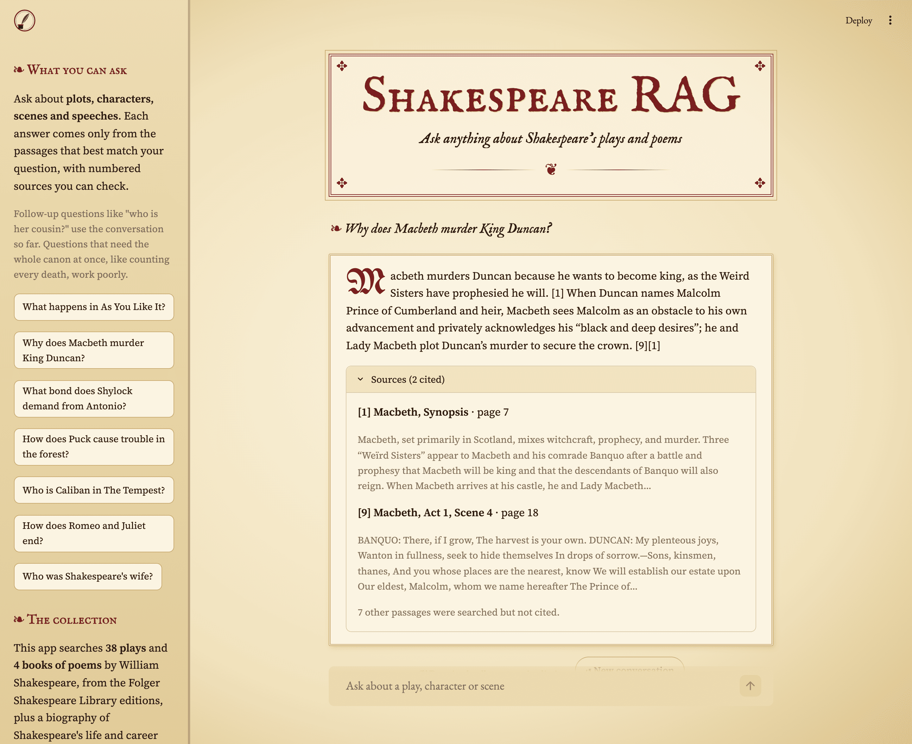
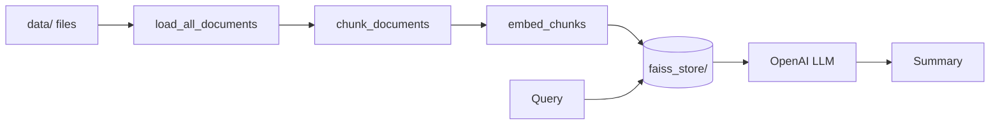

# Shakespeare RAG

Ask questions about Shakespeare's plays and poems and get answers drawn from the texts. The dataset is 38 plays and 4 poem collections from the [Folger Shakespeare Library](https://www.folger.edu/explore/shakespeares-works/) editions, and it comes with a Streamlit chat UI.

**Live demo:** [shakespeare-rag-taniket.streamlit.app](https://shakespeare-rag-taniket.streamlit.app/)



Under the hood it's a small retrieval-augmented generation (RAG) pipeline built with LangChain, which works on any documents you add:

1. **Load** files from `data/` (PDF, TXT, CSV, Excel, Word, JSON) as LangChain documents
2. **Chunk** them with `RecursiveCharacterTextSplitter`
3. **Embed** chunks with the `all-MiniLM-L6-v2` SentenceTransformer model
4. **Index** the vectors in FAISS, persisted to `faiss_store/`
5. **Retrieve** chunks with hybrid search: FAISS vector search plus BM25 keyword search, merged with Reciprocal Rank Fusion (and limited to a work when the question names one)
6. **Answer** with an OpenAI chat model, using only the retrieved passages and citing them as [1], [2]. Follow-up questions are first rewritten into standalone ones using the chat history



## Project structure

```
.
├── app.py               # Entry point: ask a question from the command line
├── chat.py              # Streamlit chat UI
├── assets/             # Chat UI logo and README demo screenshot
├── .streamlit/          # Streamlit theme (parchment colors)
├── src/
│   ├── data_loader.py   # load_all_documents(): file -> LangChain documents
│   ├── folger_loader.py # Folger PDFs -> one clean document per scene/sonnet, with speakers
│   ├── embedding.py     # EmbeddingPipeline: chunking + embeddings
│   ├── vectorstore.py   # FaissVectorStore: build, save, load, query
│   ├── retriever.py     # HybridRetriever: vector + BM25 search with rank fusion
│   └── search.py        # RAGSearch: hybrid retrieval + grounded, cited OpenAI answer
├── evals/
│   └── retrieval_eval.py # Retrieval accuracy on 25 plot, quote and sonnet questions
├── data/                # Source documents (Shakespeare PDFs in data/pdf/Shakespeare/)
├── notebook/            # Step-by-step exploration notebooks
└── notes/               # Notes on RAG concepts
```

## Getting started (first run)

Requires Python 3.12+ and an [OpenAI API key](https://platform.openai.com/api-keys).

**1. Clone the repo**

```bash
git clone https://github.com/taniket15/shakespeare-rag.git
cd shakespeare-rag
```

**2. Install dependencies**

With [uv](https://docs.astral.sh/uv/) (recommended):

```bash
uv sync
source .venv/bin/activate   # Windows: .venv\Scripts\activate
```

Or with pip:

```bash
python3 -m venv .venv
source .venv/bin/activate   # Windows: .venv\Scripts\activate
pip install -r requirements.txt
```

**3. Add your API key**

```bash
cp .env.example .env
```

Open `.env` and set `OPENAI_API_KEY` (and optionally `OPENAI_MODEL`).

**4. Add documents (optional)**

`data/pdf/Shakespeare/` already has the Folger editions of the plays and poems. To search other material, drop in your own files (PDF, TXT, CSV, `.xlsx`, `.docx`, `.json`). Subfolders are searched too.

**5. Build the vector store (only if you changed `data/`)**

```bash
python -m src.vectorstore
```

The repo already includes a prebuilt index in `faiss_store/`, so you can skip this step. To rebuild it, this command loads every file in `data/`, splits it into chunks, embeds the chunks and saves a FAISS index to `faiss_store/`, then runs a sample query to check it works. It takes a minute or two, and the embedding model is downloaded the first time. It doesn't need an OpenAI key.

> **Changed your documents?** Run this command again. It rebuilds the index from scratch and overwrites `faiss_store/`. The index for the Shakespeare dataset is committed to the repo, so the hosted app can load it instead of building it on startup. Commit it again after rebuilding.

**6. Run it**

```bash
python app.py "What happens in As You Like It?"
```

This loads the saved index from `faiss_store/`, so it starts quickly. If `faiss_store/` is missing, the first run builds it for you.

**7. Chat in the browser (optional)**

```bash
streamlit run chat.py
```

This opens the Shakespeare RAG chat page at http://localhost:8501. The sidebar lists the works in the dataset and has example questions you can click. Follow-up questions ("who is her cousin?") work: the app rewrites them into standalone questions using the conversation before searching, and shows what it searched for. Each answer lists its numbered sources.

## Usage

Each module can also be run on its own to test that stage:

```bash
python -m src.data_loader    # load documents
python -m src.embedding      # chunk + embed
python -m src.vectorstore    # build the index and run a sample query
python -m src.search         # full retrieve + summarize
```

Use it from Python:

```python
from src.search import RAGSearch

rag = RAGSearch()  # options: persist_dir, data_dir, embedding_model, llm_model
print(rag.search_and_summarize("What happens in As You Like It?", top_k=3))
```

## Evaluation

```bash
python -m evals.retrieval_eval
```

Checks whether the right work (and, for famous quotes and sonnets, the exact scene or sonnet) appears in the top 5 retrieved passages, for vector-only and hybrid search:

| Retrieval | Top-5 accuracy (25 questions) |
| --- | --- |
| Vector only (FAISS) | 56% |
| Hybrid (FAISS + BM25 + rank fusion) | 100% |

## Configuration

| Setting | Where | Default |
| --- | --- | --- |
| `OPENAI_API_KEY` | `.env` | required |
| `OPENAI_MODEL` | `.env` | `gpt-6-luna` |
| Embedding model | `RAGSearch(embedding_model=...)` | `all-MiniLM-L6-v2` |
| Chunk size / overlap | `FaissVectorStore(chunk_size=..., chunk_overlap=...)` | `1000` / `200` |
| Index location | `RAGSearch(persist_dir=...)` | `faiss_store/` |

## Notes

- Supported file types: PDF (`pypdf`), TXT, CSV, Excel `.xlsx` (`unstructured`), Word `.docx` (`docx2txt`) and JSON (`jq`). Files that fail to load are logged and skipped.
- The notebooks build a separate Chroma database in `data/vector_store/`. It is generated locally and is not committed.
- Retrieval uses FAISS `IndexFlatL2`, so a **smaller distance means a closer match**.
