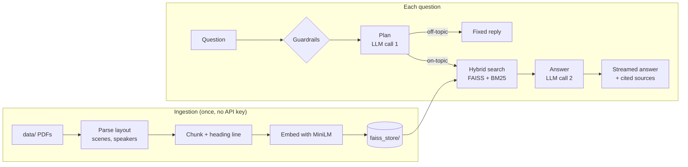
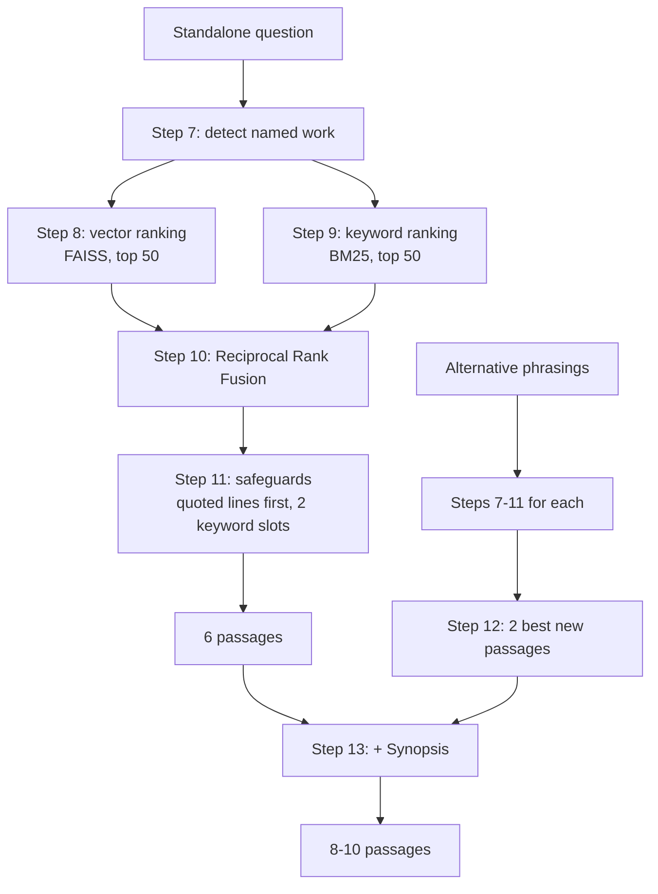

# App flow

How Shakespeare RAG turns PDFs into a searchable index, and a question into a cited answer. Each step names the file and function that does it.

**Running example:** after asking *"Tell me about Rosalind in As You Like It"*, a user asks the follow-up **"who is her cousin?"**

## Contents

1. [Overview](#overview)
2. [Ingestion](#1-ingestion-offline-once)
3. [App startup](#2-app-startup)
4. [Guardrails](#3-guardrails-before-any-api-call)
5. [Query planning](#4-query-planning)
6. [Retrieval](#5-retrieval)
7. [Answer](#6-answer)
8. [Display and bookkeeping](#7-display-and-bookkeeping)
9. [Tracing](#tracing)
10. [Cost per question](#cost-per-question)
11. [Where to change things](#where-to-change-things)

## Overview



| Stage | Runs | Code | LLM calls |
| --- | --- | --- | --- |
| Ingestion | Once, when `data/` changes | `src/data_loader.py`, `src/folger_loader.py`, `src/wiki_loader.py`, `src/embedding.py`, `src/vectorstore.py` | 0 |
| Startup | Once per app process | `RAGSearch.__init__`, `HybridRetriever.__init__` | 0 |
| Guardrails | Each question | `ui/usage.py`, `chat.py` | 0 |
| Planning | Each question | `RAGSearch.plan` | 1 |
| Retrieval | Each on-topic question | `HybridRetriever.search` | 0 |
| Answer | Each on-topic question | `RAGSearch.stream` | 1 |
| Display | Each question | `chat.py`, `ui/sources.py` | 0 |

## 1. Ingestion (offline, once)

Run with `python -m src.vectorstore`. No API key is needed. The output, `faiss_store/`, is committed so the deployed app never rebuilds it.

### Step 1: Choose a loader

`load_all_documents()` in `src/data_loader.py` walks `data/` recursively and picks a loader for each file:

| File | Loader | Recognised by |
| --- | --- | --- |
| Folger edition PDF | `load_folger_pdf()` | File name pattern (`*_PDF_FolgerShakespeare.pdf`) |
| Wikipedia PDF export | `load_wikipedia_pdf()` | `mwlib` in the PDF's metadata |
| Any other PDF, TXT, CSV, XLSX, DOCX, JSON | Standard LangChain loaders | File extension |

A file that fails to load is logged and skipped.

### Step 2: Parse the page layout

`src/folger_loader.py` reads each line with PyMuPDF, including its font size, italics and position, instead of extracting plain text.

- **Removed:** the Folger ad, table of contents, editorial notes, `FTLN` line markers, line numbers and running page headers.
- **Speakers attached to their speeches:** speaker names are recognised by their font and joined to the speech that follows, as `CELIA: …`. In verse the name sits above the first line; in prose it's 2pt lower, and both layouts are handled.
- **Stage directions bracketed:** italic directions become `[Exit]`. A direction next to a speaker name becomes `CELIA [as Aliena]: …`.
- **Kept:** the Synopsis and Characters in the Play pages, the best sources for "what happens in…" and "who is…" questions.
- **Split:** one document per scene, prologue, sonnet or front-matter section, tagged with `title`, `section`, `page` and `heading`.

`src/wiki_loader.py` does the same for the biography: one document per article section, without references, contributor lists, image captions or `[n]` markers.

**Result:** 42 Folger PDFs + 1 biography → **1,028 documents**.

### Step 3: Chunk

`EmbeddingPipeline.chunk_documents()` in `src/embedding.py` splits documents with `RecursiveCharacterTextSplitter`: chunks of up to 1,000 characters, overlapping by 200, split at paragraph, line or word boundaries where possible. Each chunk then gets its location as its first line:

```
As You Like It, Act 1, Scene 3
CELIA: Why, cousin! Why, Rosalind! Cupid have mercy, not a word?
ROSALIND: Not one to throw at a dog.
```

Documents were already split by scene, so a chunk never spans two scenes and every citation has an exact act and scene. The heading line also lets both the search and the LLM know where a passage comes from, even when the text never names the play.

**Result:** **7,470 chunks**.

### Step 4: Embed

`EmbeddingPipeline.embed()` turns each chunk into a 384-number vector with the `all-MiniLM-L6-v2` sentence-transformers model, running locally. Chunks with similar meanings get nearby vectors.

### Step 5: Store

`FaissVectorStore.build_from_documents()` in `src/vectorstore.py` writes two files to `faiss_store/`:

| File | Contents |
| --- | --- |
| `faiss.index` | The 7,470 vectors in a FAISS `IndexFlatL2`: exact search, a few milliseconds at this size |
| `metadata.pkl` | Each chunk's text and metadata, in the same order as the vectors, so vector *i* belongs to `metadata[i]` |

## 2. App startup

`streamlit run chat.py` creates one `RAGSearch` per app process, cached with `@st.cache_resource` so every visitor shares it.

1. **Load the index:** `FaissVectorStore.load()` reads `faiss_store/`. If it's missing, the index is built from `data/` first, as in steps 1–5.
2. **Build the keyword index:** `HybridRetriever.__init__` normalises every chunk (lowercase, no punctuation or apostrophes) and builds a BM25 index in memory.
3. **Build the title lookup:** each title maps to its work, along with shortened forms ("tempest", "henry iv" for both parts) and aliases from `ALIASES` ("lear", "shrew", "midsummer").
4. **Create the LLM client:** `ChatOpenAI` with the model from `OPENAI_MODEL`, capped at `MAX_OUTPUT_TOKENS` (4,000) per call, hidden reasoning included. The planner is the same model with structured output (`SearchPlan`).

Each browser session also gets its own `messages` list, a `questions_asked` counter and a `thread_id` for tracing.

## 3. Guardrails (before any API call)

`chat.py` and `ui/usage.py` check limits before a question reaches the LLM.

| Check | Limit | When it's hit |
| --- | --- | --- |
| Question length | 500 characters (`MAX_QUESTION_CHARS`) | The input stops accepting text |
| Questions this visit | 20 (`MAX_QUESTIONS_PER_SESSION`) | Input disabled, notice shown |
| Questions today, all visitors | 300 (`MAX_QUESTIONS_PER_DAY`) | Input disabled, notice shown |

The remaining count is shown above the input. `IS_LOCAL=true` turns the visit and daily limits off. Two more guardrails apply later: the off-topic gate in step 6 and the output cap in step 15.

If the question passes, `count_question()` increments both counters, the question is added to the chat, and a `chat_turn` trace starts.

## 4. Query planning

`RAGSearch.retrieve()` → `RAGSearch.plan()` in `src/search.py`. **LLM call 1, about 430 tokens.**

### Step 6: Plan the search

The model receives the last 6 messages (`HISTORY_MESSAGES`) and the new question, with `SEARCH_PLAN_PROMPT`, and returns a `SearchPlan`:

```json
{
  "question": "Who is Rosalind's cousin in Shakespeare's As You Like It?",
  "alternatives": ["Rosalind cousin Celia Duke Frederick daughter",
                   "Celia Rosalind cousins As You Like It"],
  "on_topic": true
}
```

| Field | Purpose |
| --- | --- |
| `question` | The follow-up rewritten to stand alone: "her" becomes Rosalind and the play is named. Search no longer needs the chat history. |
| `alternatives` | Two rephrasings in the words a source would use, such as the formal terms a biography uses. Used in step 12. |
| `on_topic` | Whether the question is about Shakespeare's works, characters, life or times. |

**Off-topic gate:** if `on_topic` is false ("What is the capital of France?", "ignore your instructions and…", "hi"), `retrieve()` returns no passages. `stream()` then shows `OFF_TOPIC_ANSWER` without searching or calling the LLM again. A declined question costs about 450 tokens instead of about 2,600.

## 5. Retrieval

`HybridRetriever.search()` in `src/retriever.py`. All local: no API calls, a few hundred milliseconds. The goal is to choose about 8 of the 7,470 chunks.



### Step 7: Detect a named work

`detect_filter()` checks the normalised question against the title lookup.

- **"Sonnet 116":** only that sonnet.
- **A play title or alias:** only chunks from that work. Our example names *As You Like It*.
- **Neither:** the whole collection.

### Step 8: Rank by meaning (vector search)

The question is embedded with the same MiniLM model, and FAISS ranks chunks by distance; smaller means closer. With a filter, FAISS ranks all chunks and those from other works are dropped. The top 50 (`CANDIDATES`) remain.

### Step 9: Rank by exact words (BM25)

The question's words are scored against every chunk's words. Rare words count more, so "rosalind" outweighs "is". Chunks outside the filter and those with a score of 0 are dropped, and the top 50 remain. BM25 catches what embeddings miss: quotes, names and numbers.

### Step 10: Merge the rankings

Reciprocal Rank Fusion gives each chunk `1 / (60 + rank)` from each list and adds them. It uses only positions, so the two methods' different score scales don't need balancing. A chunk ranked well in both lists beats one ranked first in only one.

### Step 11: Apply the safeguards

Fusion can bury a passage that only one method ranks highly, so two rules protect exact matches:

- **Quoted lines first:** if the question quotes 2 or more words (`"Out, damned spot"`), every allowed chunk containing that phrase gets +1.0, more than any fused score.
- **Reserved keyword slots:** the top 2 BM25 matches (`KEYWORD_SLOTS`) always make the cut.

### Step 12: Add results from the alternative phrasings

With alternatives, the main question fills 6 slots (`top_k` − `ALTERNATIVE_SLOTS`). Each alternative runs through steps 7–11, and passages the main question didn't already find are fused by rank. The best 2 fill the remaining slots, so the rephrasings can add passages but never replace the main results.

### Step 13: Add the Synopsis

If the question names one or two plays, each play's Synopsis is added if it isn't already included, so overview questions ("What happens in As You Like It?") get the whole plot.

**Result:** 8–10 passages, each `{"index", "score", "metadata": {"text", "title", "section", "page", "heading", ...}}`. The example retrieved 10, starting with *As You Like It*.

## 6. Answer

`RAGSearch.stream()` in `src/search.py`. **LLM call 2, about 2,300 tokens,** mostly the passages.

### Step 14: Build the prompt

The passages are numbered and sent after `SYSTEM_PROMPT`:

```
Passages:
[1] As You Like It, Act 1, Scene 2
CELIA: I pray thee, Rosalind, sweet my coz, be merry. ...

[2] As You Like It, Synopsis
...

Question: Who is Rosalind's cousin in Shakespeare's As You Like It?
```

The system prompt's rules:
- Use only the passages, never memory, even when the model knows the answer.
- Cite passages as `[1]` or `[2][3]` right after the statement they support.
- Use each passage's heading to say where things happen.
- Combine specific details: who, what, how, why, and what happened as a result.
- If the passages don't contain the answer, say so and describe what they do cover.
- Length: 2–4 sentences, or up to two short paragraphs for a plot summary.

### Step 15: Stream

The answer streams token by token into the UI:

> Rosalind's cousin is Celia, the daughter of Duke Frederick. [1]

Each call is capped at 4,000 output tokens (`MAX_OUTPUT_TOKENS`), enough for normal answers, which use 20–600. If the cap runs out during the model's hidden reasoning before any text appears, the user sees `EMPTY_ANSWER`, a request for a shorter question, instead of a blank reply.

## 7. Display and bookkeeping

`chat.py` and `ui/sources.py`.

### Step 16: Show the rewritten question

If the plan rewrote the question, a caption shows "Searched for: Who is Rosalind's cousin in …", so users can see how their follow-up was understood.

### Step 17: Show the cited sources

`to_sources()` turns each passage into a heading, page number and 300-character excerpt. `show_sources()` reads the `[n]` markers in the answer and lists **only the cited passages, with the same numbers**, so `[1]` in the answer is `[1]` in the panel. If nothing was cited, for example when the passages didn't contain the answer, it lists every passage under "Passages searched".

### Step 18: Record the turn

- The answer, sources and rewritten question are saved to the chat history. The next follow-up's plan (step 6) sees them.
- The `chat_turn` trace closes with the answer.
- If this question used up a limit, the page redraws with the input disabled.
- **↺ New conversation** clears the history and starts a new trace thread.

## Tracing

With the `LANGSMITH_*` variables set, every question becomes one LangSmith trace. Conversations are grouped by `thread_id`.

```
chat_turn                        ← chat.py, one per question
├─ retrieve
│  ├─ plan → ChatOpenAI          ← standalone question, alternatives, on_topic
│  └─ hybrid_search              ← retriever: passages with title, section, page, score
└─ generate → ChatOpenAI         ← question + passage count in, answer out
```

Runs from `app.py` or `evals/answer_eval.py` appear as a `rag_answer` trace with the same steps. Without the variables, tracing is off and nothing leaves the app except the OpenAI calls.

## Cost per question

Measured from LangSmith traces:

| Question type | Plan | Answer | Total tokens |
| --- | --- | --- | --- |
| Normal question | ~430 | ~2,100–2,500 | ~2,200–2,900 |
| Off-topic (declined) | ~450 | none | ~450 |

Ingestion, startup, retrieval and display make no LLM calls. Almost all the cost is the answer prompt's 8–10 passages.

## Where to change things

| To change | Where |
| --- | --- |
| Passages per answer | `TOP_K` in `src/search.py` (8) |
| Answer style and grounding rules | `SYSTEM_PROMPT` in `src/search.py` |
| Follow-up rewriting, alternatives, off-topic rules | `SEARCH_PLAN_PROMPT` and `SearchPlan` in `src/search.py` |
| Output cap | `MAX_OUTPUT_TOKENS` in `src/search.py` (4,000) |
| Fusion depth and reserved slots | `CANDIDATES`, `RRF_K`, `KEYWORD_SLOTS`, `ALTERNATIVE_SLOTS` in `src/retriever.py` |
| Short names for works | `ALIASES` in `src/retriever.py` |
| Chunk size and overlap | `FaissVectorStore(chunk_size=..., chunk_overlap=...)` (1,000 / 200), then rebuild the index |
| Embedding model | `RAGSearch(embedding_model=...)`, then rebuild the index |
| Usage limits | `MAX_QUESTIONS_PER_SESSION`, `MAX_QUESTIONS_PER_DAY` (env), `MAX_QUESTION_CHARS` in `ui/usage.py` |
| Chat model | `OPENAI_MODEL` in `.env` |

After changing retrieval, run `python -m evals.retrieval_eval` (no API calls). After changing prompts or `TOP_K`, run `python -m evals.answer_eval`.
