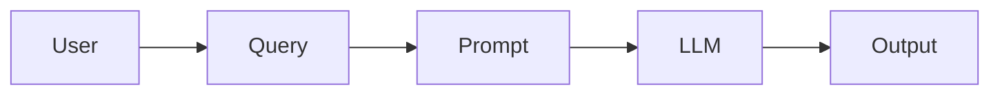
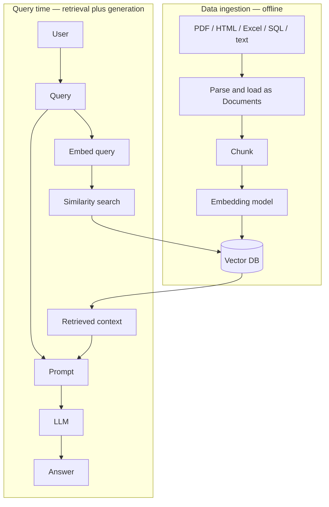
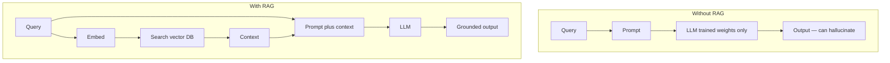
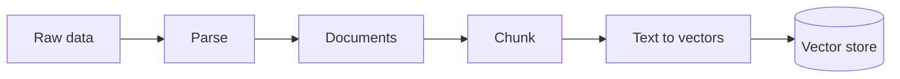
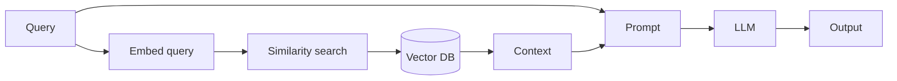
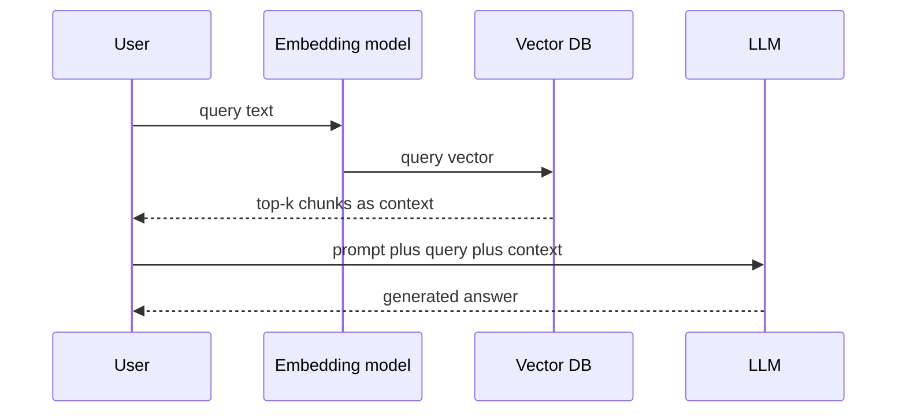
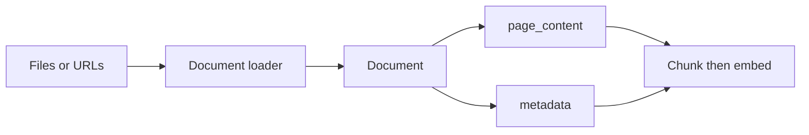
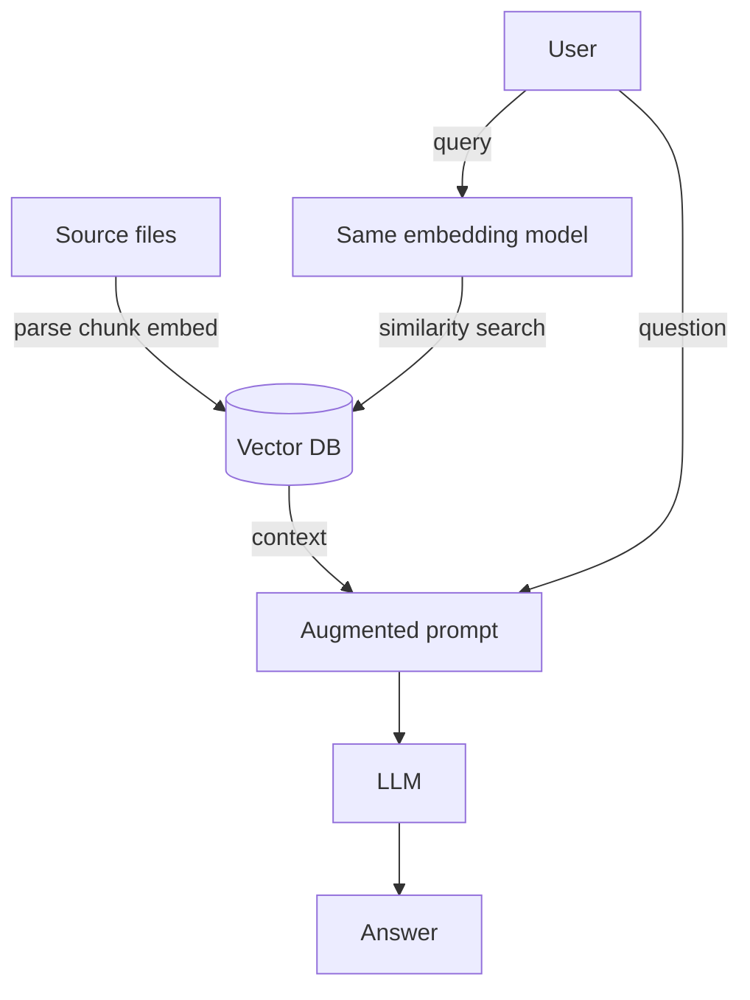
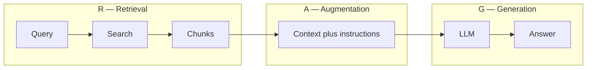

# RAG — Intro and Document Structure

What RAG is, why it exists, the two pipelines, and LangChain’s `Document` plus loaders.

---

## 1. Scope

- **RAG (Retrieval-Augmented Generation)** from theory through a working pipeline: **data ingestion → retrieval → output generation**.
- LLMs, embedding models, **chunking**, then **modular / production-style** code.
- Typical path: notebooks first → reusable classes → a pipeline you can reuse at work.
- Later topic: **agentic RAG**.
- **Python is required.**

**Terminology:** this noteset uses **data ingestion** (not “injection”).

---

## 2. What is RAG? (definition)

RAG **optimizes LLM output** by **looking up an authoritative knowledge base outside the model’s training data** before generating an answer.

- LLMs are trained on large public corpora and are good at Q&A, translation, completion, etc.
- RAG **extends** that to a **domain or private org knowledge** **without retraining** the model.
- It is a **cost-effective** way to make answers more **relevant, accurate, and useful** in a specific context.

**Plain English:** keep the pretrained LLM; at query time, **retrieve** relevant private/current text and **stuff that context** into the prompt so the model answers from **your** sources, not only from memory.

---

## 3. Vanilla GenAI app (no RAG)



The LLM only uses **what it was trained on** (plus the prompt). That is enough for general generation, and it is **not** enough for:

1. facts **after the training cutoff**, or
2. **private** company data that was never in the training set.

---

## 4. Two problems RAG is meant to fix

### 4.1 Hallucination (stale / missing knowledge)

- Models have a **knowledge cutoff**. A model released late in a month may only have been trained on data through the start of that month.
- Ask about events **between cutoff and today** → the model has **no grounded knowledge**.
- It often **still produces a fluent answer** → **hallucination**: confident, plausible, **wrong or made-up**.

RAG does **not fully eliminate** hallucination. If the vector store has **no** relevant docs, the LLM can still invent. RAG mainly helps when the answer **is** in the retrieved context.

### 4.2 Private / changing data vs fine-tuning

Example: **HR / finance / internal policies** are not on the public web, but you still want a chatbot over them.

| Approach | Idea | Why it’s often a poor fit |
|----------|------|---------------------------|
| **Fine-tune** | Bake policies into model weights | Expensive, slow (billions of params); policies **change**; you cannot retrain every day |
| **RAG** | Keep policies in an **external store**; retrieve at query time | Update docs in the store instead of retraining |

---

## 5. Traditional RAG architecture

Two pipelines share one **vector store** (vector DB).



**Vanilla vs RAG**



### 5.1 Data ingestion pipeline (offline / batch)

Goal: turn **your** files into **searchable vectors**.



- **Parsing** is the high-leverage step: if you read and split data well, the rest of RAG gets much easier.
- **Chunking:** split into smaller pieces so each piece fits **embedding (and later LLM) context limits**. You cannot dump a 100-page PDF into an embedding model as one blob.
- **Embeddings:** numeric vectors so you can use **similarity search** (e.g. cosine similarity). Providers: OpenAI, Google/Gemini, Hugging Face, plus **open-source** models (cost vs quality tradeoff).
- Result: an **external knowledge base** the base LLM was **not** fully trained on.

### 5.2 Retrieval pipeline (online / per query)





Example: *“What is the company leave policy?”* → retrieve policy chunks → LLM answers **from that context**.

This is the **R-A-G** breakdown:

| Letter | Meaning |
|--------|---------|
| **R**etrieval | Query → vector search → relevant chunks |
| **A**ugmentation | Attach those chunks + instructions to the prompt |
| **G**eneration | LLM writes the final answer |

### 5.3 Why this reduces the two problems

- **Cutoff / news:** ingest newer docs, or add tools such as web search.
- **Private policies:** ingest internal files; **update the store** when policies change instead of fine-tuning.

Products that combine retrievers, tools, web search, and LLM summarization (often with multiple models) go **beyond** simple “one vector DB” traditional RAG.

---

## 6. Why `Document` exists (LangChain)

Anything you ingest should become a **`Document`**: a standard unit for chunking, embedding, and storage.

### Core fields

| Field | Role |
|--------|------|
| **`page_content`** | The actual text that will be embedded and retrieved |
| **`metadata`** | Extra fields: file path, page count, timestamps, author, format, etc. |

**Why metadata matters:** after vectors are in the DB, you can **filter** search (e.g. author, `source = "hr_policy.pdf"`), not only semantic similarity.

Loaders (PDF, CSV, web, directory, S3, …) all aim to return **`Document` objects** (often a **list** of them). That is the point of the abstraction.



**Manual example:**

```python
from langchain_core.documents import Document

doc = Document(
    page_content="This is the main text content I'm using to create RAG",
    metadata={
        "source": "example.txt",
        "pages": 1,
        "author": "Example Author",
        "date_created": "2024-01-01",
    },
)
```

Import: `langchain_core.documents.Document`.

---

## 7. Environment setup

- Workspace + **`uv`** env (example: Python 3.13.x).
- Packages: `langchain`, `langchain-core`, `langchain-community`, plus PDF libs **`pypdf` / `pymupdf`**, and **`ipykernel`** for notebooks.
- Folders: `data/` (e.g. `text_files/`, `pdf/`) and `notebook/`.

This repo follows that layout (`notebook/pdf_loader.ipynb`, `data/pdf/`).

---

## 8. Hands-on: loaders

### 8.1 `TextLoader`

- Reads one `.txt` file.
- `loader.load()` → list of `Document`.
- Typical metadata: at least a **file path**. You can add more yourself.
- Encoding: e.g. `encoding="utf-8"`.
- Import: `langchain.document_loaders` **or** `langchain_community.document_loaders` — use whichever is current; watch deprecation warnings.

### 8.2 `DirectoryLoader`

- Path + **glob** (e.g. `*.txt`).
- **`loader_cls`:** which loader to use per file (`TextLoader`, PDF loader, …).
- Can mix types if you configure it that way.
- `show_progress=True` may require extra deps (e.g. `tqdm`); turn it off if you hit install errors.

Result: **one `Document` per file** (before chunking). Then you split those documents into chunks.

### 8.3 PDFs: PyPDF vs PyMuPDF

Both live under community document loaders.

- **PyPDF:** parse with pypdf.
- **PyMuPDF:** parse with PyMuPDF; often richer **metadata** (creation date, file path, **total_pages**, format, sometimes author from the PDF).

`type(pdf_documents[0])` → `Document`. The list is still **documents**, not raw bytes.

PDF loaders generally **do not** need a UTF-8 encoding argument the way text files do.

---

## 9. Practice

After PDF and txt:

1. Repeat the **same ingestion path** for **another format** (Excel, CSV, JSON, DB, …).
2. Open LangChain **document loaders** docs, pick a loader, authenticate if needed (e.g. S3).
3. Check that output is a **solid `Document` list** (`page_content` + useful `metadata`).

---

## 10. What comes next

After documents:

1. **Chunking** (including later: semantic chunker, context engineering).
2. **Embeddings** (open-source + paid).
3. **Vector store** + **retriever**.
4. Query embedding → retrieve → augment prompt → generate.

Optimization of parsing/chunking is a later deep dive.

Implementation of load → chunk → embed → Chroma: [Ingestion: PDFs, chunking, embeddings, vector store](rag-ingestion-chunking-embeddings.md).

---

## 11. Mental model

**Ingestion** builds the knowledge base. **Retrieval + augmentation + generation** answers a question **using** that base.




